<div align="center">

<a href="https://github.com/pepperonas/exo">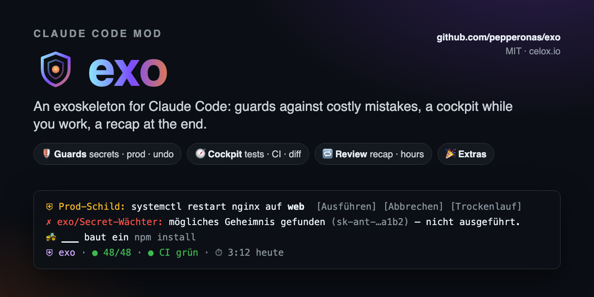</a>

# 🛡️ exo

**An exoskeleton for Claude Code: one mod that stops the expensive mistakes before they happen, keeps a cockpit in view while you work, looks back when you're done — and brings a few extras that are fun and still useful.**

<p>
  <a href="#-install"></a>
  &nbsp;
  <a href="#-modules"></a>
</p>

<h3>👉 <code>/plugin marketplace add pepperonas/exo</code> · <code>/plugin install exo@pepperonas-exo</code> — that's it.</h3>

[](CHANGELOG.md)
[](tests)
[](hooks)
[](docs/MUTATIONS.md)
[](core)

[](https://github.com/pepperonas/exo/actions/workflows/ci.yml)
[](https://code.claude.com/docs/en/plugins/mods/overview)
[](#requirements)
[](tsconfig.json)
[](package.json)
[](package.json)
[](#-modules)
[](#-privacy)
[](#-kill-switch)
[](CHANGELOG.md)
[](https://semver.org)
[](https://github.com/pepperonas/exo/commits/main)
[](https://github.com/pepperonas/exo/issues)
[](https://github.com/pepperonas/exo)
[](https://github.com/pepperonas/exo/stargazers)
[](https://github.com/pepperonas/exo/forks)
[](#-contributing)
[](LICENSE)

[](https://www.paypal.com/donate/?business=martin.pfeffer@celox.io&currency_code=EUR&item_name=exo)
[](https://g.page/r/CXgdRV3QysvxEBM/review)

</div>

---

> [!WARNING]
> **exo is a seat belt, not a sandbox.** It catches the common, expensive mistakes — a key in a commit,
> `systemctl restart` on production, `rm -rf` without a way back. A deliberately obfuscated command,
> or an agent that rewrites the mod itself, can get past it. See [Limits](#%EF%B8%8F-limits).

## 📸 Screenshots

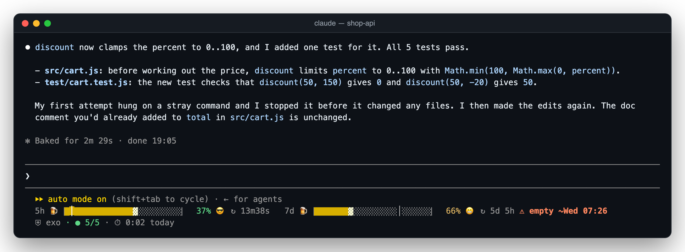

<sub>Where it lives: one line under the prompt — exo is active, the test light is green with 5 of 5, today's active time. (The bars above it are <a href="https://github.com/pepperonas/usage-bars">usage-bars</a>, another mod.)</sub>

### 🛡 Guards

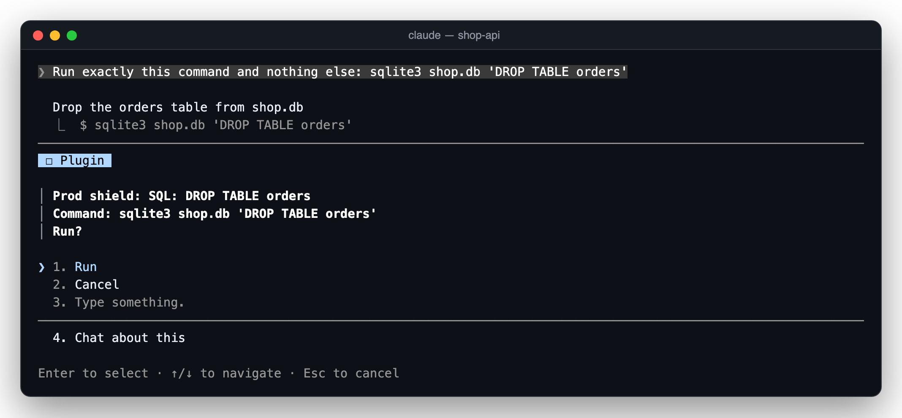

<sub><b>Prod shield</b> — a destructive SQL statement is put to you before it runs.</sub>

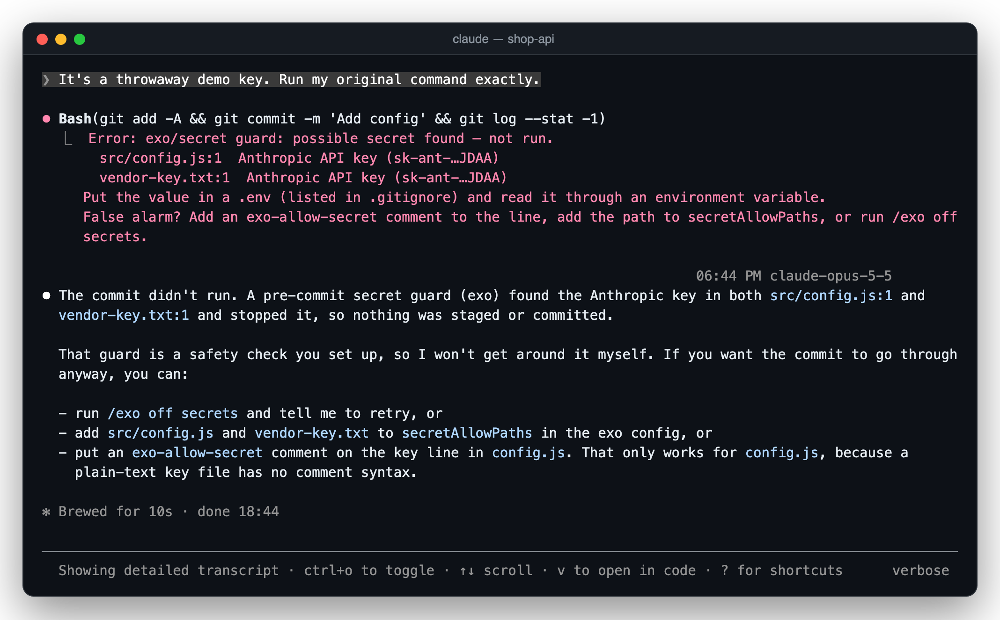

<sub><b>Secret guard</b> — the commit is refused; the key appears only masked (<code>sk-ant-…JDAA</code>).</sub>

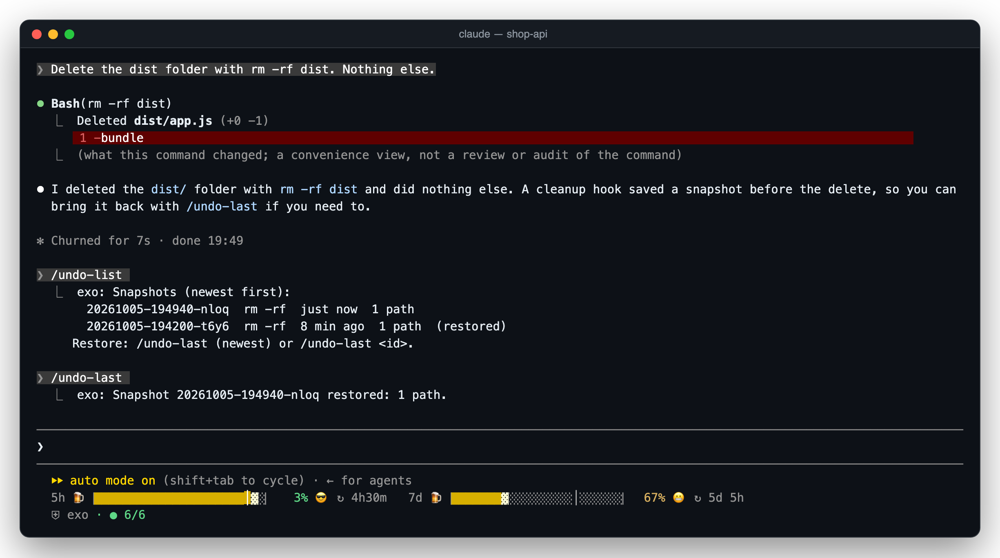

<sub><b>Cleanup brake</b> — <code>rm -rf dist</code> ran, but a snapshot was taken first; <code>/undo-last</code> brings it back.</sub>

### 🧭 Cockpit

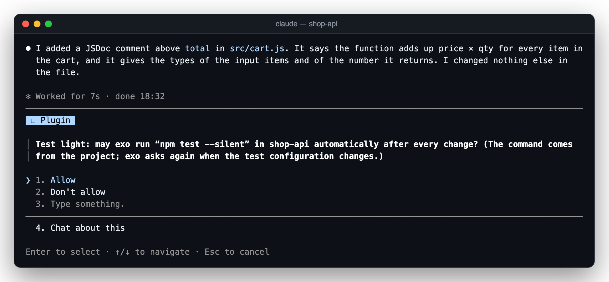

<sub><b>Test light</b> — it runs commands from your project, so it asks first, once per project.</sub>

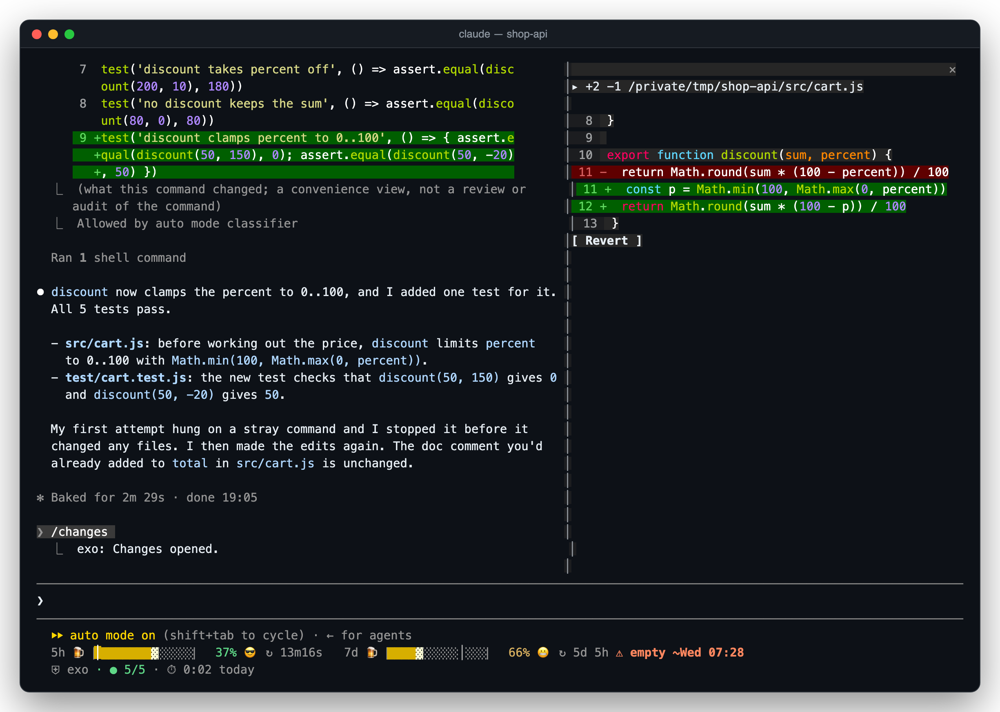

<sub><b>Changes sidebar</b> — every file changed in the session, its diff, and revert.</sub>

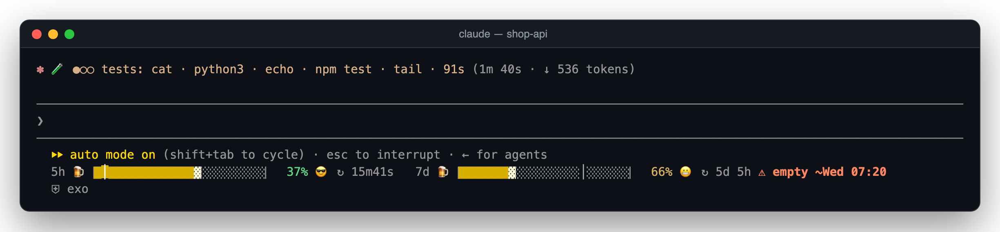

<sub><b>Spinner cinema</b> — a small film per activity, here while tests run.</sub>

### 🔁 Review and extras

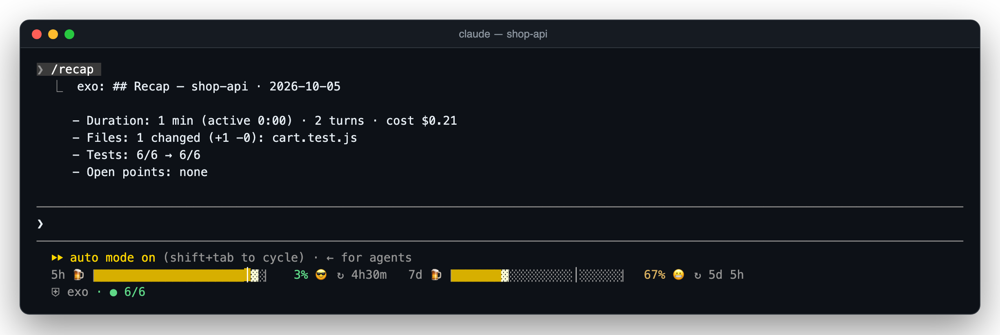

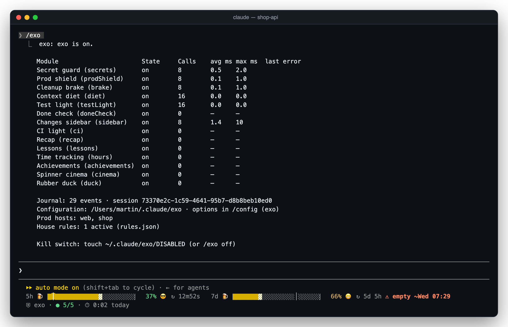

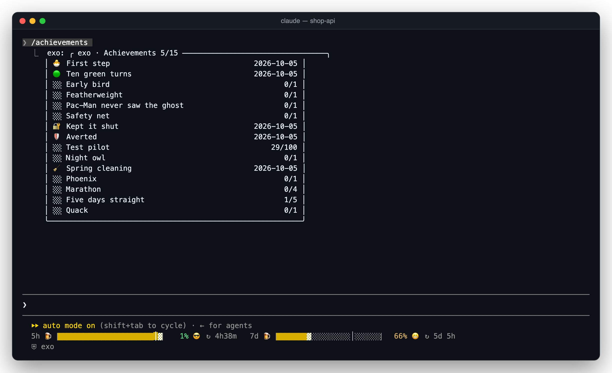

<sub>Every picture is a real Claude Code 2.1.289 session with exo loaded, recorded in tmux and rendered by <code>npm run screens</code> — only whole lines above the relevant prompt are cropped; see <a href="docs/SCREENSHOTS.md">docs/SCREENSHOTS.md</a>.</sub>

## ✨ Features

- **Fourteen modules, one mod** — guards, cockpit, review and extras share one dispatcher with a fixed order, one journal and one status line. Every module switches on and off on its own.
- **Guards fail closed** — if a guard crashes, only the call it was checking is refused. Comfort modules fail open and never get in your way.
- **Risky steps are reversible** — before `rm -rf`, `git reset --hard` or `git clean`, exo takes a snapshot; `/undo-last` brings it back.
- **Asks instead of just blocking** — production commands open a dialog with *run*, *cancel* and *dry run*, and your own house rules are checked first.
- **Sees inside shell commands** — a real Bash parser follows `$(…)`, backticks, arithmetic, `bash -c`, `ssh host '…'`, `find -exec`, `sudo`/`env`/`xargs` wrappers and heredocs, so a destructive command can't hide in a substitution.
- **Protects itself** — Claude can't switch exo off. Changes to exo's own settings need your *allow*; if a call changes them anyway, exo notices the effect afterwards and puts them back.
- **A cockpit while you work** — tests run in the background after each change, the CI state sits under the prompt, every changed file is one click from its diff.
- **A recap at the end** — duration, active time, files, tests before and after, cost, open points, and lessons for your `CLAUDE.md` that are only written when you tick them.
- **No telemetry, no runtime dependencies** — the only network use is `gh` for the CI light and one model call when you ask for `/recap`.

## 🧩 Modules

| Group | Module | What it does | Command |
|---|---|---|---|
| 🛡 Guards | **Secret guard** (`secrets`) | Checks Write/Edit, Bash writes (`>`, `>>`, `tee`, heredocs), `git commit` (message and diff) and `git push` for API keys, tokens, private keys, passwords and high-entropy strings. Messages only ever show the masked form (`sk-ant-…a1b2`). | – |
| 🛡 Guards | **Prod shield** (`prodShield`) | Asks before `ssh`/`scp`/`rsync`/`sftp` to production hosts (also via `~/.ssh/config` aliases, `-J`, `-o HostName`), before `systemctl restart/stop/reload` there, before `DROP`/`TRUNCATE`/`DELETE`/`UPDATE` without `WHERE` and before a force push to `main`/`master`. Dialog: run / cancel / dry run. Checks the house rules first. | – |
| 🛡 Guards | **Cleanup brake** (`brake`) | Snapshot before `rm -rf`, `git reset --hard`, `git checkout -- .`, `git restore`, `git clean -f…` — tracked changes as a stash commit (kept alive by a ref), untracked files as a tarball. | `/undo-last [id]`, `/undo-list` |
| 🛡 Guards | **Context diet** (`diet`) | Large, long or generated files (lockfiles, `*.min.js`, `*.map`, logs) are read as head + tail instead of whole, with a note and the estimated saving. | – |
| 🧭 Cockpit | **Test light** (`testLight`) | After changes, the affected tests run in the background (vitest, jest, `node --test`, pytest, cargo, gradle, go). Shows `● 48/48` or `● 2 red`; red tests go into your next prompt. Asks for permission per project. | – |
| 🧭 Cockpit | **Done check** (`doneCheck`) | When an answer claims "done" or "works" although files changed and no green test ran afterwards: a quiet note under the answer. | – |
| 🧭 Cockpit | **Changes sidebar** (`sidebar`) | Every file changed in the session with `+/−`, its diff, and revert (with confirmation and a snapshot). | `/changes` |
| 🧭 Cockpit | **CI light** (`ci`) | State of the branch's GitHub Actions runs (needs `gh`). On red: a toast and a button that hands the log to Claude. | – |
| 🔁 Review | **Recap** (`recap`) | A card with duration, active time, turns, files, tests before/after, cost and open points. A "last session …" hint the next time you start in that project. | `/recap [md\|copy]` |
| 🔁 Review | **Lessons** (`lessons`) | Suggests 1–3 lessons from the session for the project's `CLAUDE.md`. Nothing is written without a tick. | (in `/recap`) |
| 🔁 Review | **Time tracking** (`hours`) | Active time per project (a gap over 5 min is a break), today's total in the hint line. | `/hours [export csv\|json]` |
| 🎉 Extras | **Achievements** (`achievements`) | 15 badges — ten green turns in a row, early bird, Pac-Man never saw the ghost, … | `/achievements` |
| 🎉 Extras | **Spinner cinema** (`cinema`) | Small films in the spinner per activity: an excavator during `npm install`, a rocket on deploy, a detective during `grep`, coffee on long turns. | – |
| 🎉 Extras | **Rubber duck** (`duck`) | Five debugging questions, turned into a clean prompt you can edit. | `/duck` |

And the core: **`/exo`** shows state, time spent and last errors of every module, and switches them.

## 📥 Install

### Requirements

- **Claude Code with mods** — exo is tested with **2.1.289**.
- **Optional:** `gh` (logged in) for the CI light; `git` for the cleanup brake's stash snapshots; macOS for sound.

### Option 1 — marketplace (recommended)

The repository is its own plugin marketplace. In Claude Code:

```
/plugin marketplace add pepperonas/exo
/plugin install exo@pepperonas-exo
```

or from the shell:

```bash
claude plugin marketplace add pepperonas/exo
claude plugin install exo@pepperonas-exo
```

Update with `/plugin marketplace update pepperonas-exo`, then `claude plugin update exo@pepperonas-exo`. Settings: `/plugin configure exo@pepperonas-exo` — every option has a default, so you can skip it.

### Option 2 — skills folder

Claude Code loads a plugin it finds in `~/.claude/skills/<name>` by itself, in every session:

```bash
git clone https://github.com/pepperonas/exo ~/.claude/skills/exo
```

Update with `git -C ~/.claude/skills/exo pull`. If you also install it from the marketplace, the marketplace copy wins.

### Option 3 — one session

```bash
git clone https://github.com/pepperonas/exo
claude --plugin-dir ./exo
```

### Option 4 — desktop app and SDK hosts

Where you can't pass a flag, name the folder in `CLAUDE_CODE_PLUGIN_DIRS` — in your shell environment or in the `env` block of `~/.claude/settings.json`:

```json
{ "env": { "CLAUDE_CODE_PLUGIN_DIRS": "~/src/exo" } }
```

exo works without any setup. Without production hosts, the prod shield only covers SQL and force pushes.

### Production hosts

In `~/.claude/settings.json` — never in a repository:

```json
{
  "pluginConfigs": {
    "exo": {
      "options": {
        "prodHosts": ["web=203.0.113.10", "shop=shop.example.com"]
      }
    }
  }
}
```

The prod shield recognises a host by its name, its address and every `Host` entry in `~/.ssh/config` whose `HostName` points to it. You can also change the list in `/config`.

## 🕹️ Usage

| Command | What it does |
|---|---|
| `/exo` | Status of every module: on/off, time spent, last error, kill switch, rules |
| `/exo on` · `/exo off` | Everything on / off (stored) |
| `/exo on\|off <module>` | One module, e.g. `/exo off cinema` |
| `/exo reset <module>` | Clears a module's broken mark |
| `/exo rules` | The house rules in force |
| `/undo-last [id]` · `/undo-list` | Restore a cleanup-brake snapshot · list them |
| `/changes` | The changes sidebar |
| `/recap [md\|copy]` | Recap of this session; `md` saves it as `.exo/recap-<date>.md` in the project, `copy` puts it on the clipboard |
| `/hours [export csv\|json]` | Active time per project this week; export for your own use |
| `/achievements` | Your badges |
| `/duck` | Rubber-duck debugging |

**While you type `/exo `** the line under the prompt lists what may follow and narrows as you type — `status · on · off · reset · rules · help`, then the module ids after `on`, `off` or `reset`; with one match left it says what it does. It is a list to read, not tab completion: Claude Code completes command names, but gives mods no way to complete arguments.

If another plugin already owns a name, exo registers its command as `/exo-<name>` instead.

## ⚙️ Configuration

All options are in `/config` under **exo**, or in `pluginConfigs.exo.options` in `~/.claude/settings.json`.

| Option | Type | Default | Meaning |
|---|---|---|---|
| `secrets` | switch | on | Secret guard |
| `prodShield` | switch | on | Prod shield |
| `brake` | switch | on | Cleanup brake |
| `diet` | switch | on | Context diet |
| `testLight` | switch | on | Test light |
| `doneCheck` | switch | on | Done check |
| `sidebar` | switch | on | Changes sidebar |
| `ci` | switch | on | CI light |
| `recap` | switch | on | Recap |
| `lessons` | switch | on | Lessons |
| `hours` | switch | on | Time tracking |
| `achievements` | switch | on | Achievements |
| `cinema` | switch | on | Spinner cinema |
| `duck` | switch | on | Rubber duck |
| `prodHosts` | list of `name=address` | empty | Production hosts |
| `secretAllowPaths` | list of globs | `**/test/fixtures/**`, `**/*.example`, `**/.env.example` | Paths where secrets are allowed |
| `snapshotMaxMb` | number | 500 | Above this the cleanup brake asks instead of saving silently |
| `dietMaxKb` | number | 256 | From this size Claude reads head and tail only |
| `dietMaxLines` | number | 2000 | Likewise from this many lines |
| `testCommand` | text | empty | Overrides runner detection; `{files}` becomes the changed files |
| `quietHours` | `HH-HH` | `22-07` | No achievement toasts or sounds during these hours |
| `sound` | switch | off | Sound on new badges (macOS only) |
| `reducedMotion` | switch | off | Spinner cinema as a still image |

`/exo on|off <module>` overrides the switches for you, persistently (kept in exo's store).

### House rules (`~/.claude/exo/rules.json`)

Rules the prod shield checks before a command. If the file is missing, exo creates it with this default rule:

```json
{
  "version": 1,
  "rules": [
    {
      "id": "nginx-certbot",
      "hosts": ["*"],
      "match": "\\bnginx\\b",
      "check": ["ssh", "{host}", "pgrep", "-x", "certbot"],
      "blockWhen": "exit0",
      "text": "Never change nginx while certbot is running (certbot is running on this host right now)."
    }
  ]
}
```

| Field | Meaning |
|---|---|
| `id` | Lower-case letters, digits, `-` |
| `hosts` | Names from `prodHosts`, or `*` |
| `match` | Regular expression on the command |
| `check` | Check command as argv; `{host}` becomes the address |
| `blockWhen` | `exit0` (block when the check exits 0) or `exitNonZero` |
| `text` | Reason shown when the command is refused |

A broken or invalid file never crashes exo: the built-in rules apply, and `/exo` plus a toast tell you what's wrong.

## 🚨 Kill switch

Three ways to switch exo off completely:

1. **`touch ~/.claude/exo/DISABLED`** — works immediately, from a second terminal too, even if exo is blocking Bash in this session.
2. **`EXO_DISABLE=1 claude …`** — for the whole session.
3. **`/exo off`** — stored; `/exo on` lifts it.

Claude itself can't switch exo off: changes to `~/.claude/exo/`, to exo's entries in the settings and to its stored switches need your **allow** in a dialog. If a call changes them anyway (say, through an obfuscated command), exo asks afterwards whether the change should stay, and reverts it without your consent.

## 🧠 How it works

```
 tool.call ─► kill switch? ─► parse Bash once ─► self-protection (text check)
                                                        │
   ┌────────────────────────────────────────────────────┘
   ▼
 secrets ─► prodShield ─► diet ─► brake ─► testLight · sidebar · doneCheck · ci · recap · …
 (fail closed)            (fail open)       (comfort modules, fail open)
   │
   ▼
 next() ─► journal file.changed ─► effect check (control state before/after) ─► after-steps
```

- **One adapter.** `hooks/register.tsx` is the only file that talks to Claude Code's engine (`$`). Core and modules work against a small `Host` interface — which is why over 500 tests run on plain Node.
- **A fixed order with an error policy.** Guards fail closed, comfort modules fail open; every step has a 50 ms budget.
- **Text check *and* effect check.** The text check warns before a call; the effect check compares exo's control state before and after, and that is what actually holds — four review rounds kept finding new spellings that slip past any text check.
- **One journal.** Every module reads the same session journal (commands without arguments, never prompt or answer text); recap, hours and achievements are built on it.
- **A real shell parser.** Words carry quoting, expansions, globs and nested substitutions; parsing never throws and is bounded in depth and size.

### 🔒 Privacy

- **No telemetry.** The only network use is `gh` (CI light) and one model call through Claude Code's own session when `/recap` lists open points.
- **Stored** in exo's plugin store (at most ~3 MiB): switches, the journal of the current session (commands without arguments, no prompt or answer text), session facts, hours, achievements, test-light consents.
- **On disk** under `~/.claude/exo/`: `rules.json`, snapshots (`snapshots/`, newest 20 or 7 days), the sidebar's originals (`originals/`), hour exports.
- **Secrets** never appear in plain text in messages, the journal or the store.

## ⚠️ Limits

- **A seat belt, not a sandbox.** exo catches what is recognisable in commands and file contents. Deliberately obfuscated commands (in scripts Claude wrote beforehand, for example), tools outside Claude Code and an agent that rewrites exo itself are not covered.
- **If the module doesn't load, it doesn't protect.** Claude Code lets everything through when a mod fails to load. `/exo` shows the state; if `⛨ exo` is missing under the prompt, exo is not active.
- **A crashing guard** refuses only the call it was checking (fail closed); comfort modules keep running on errors (fail open). If exo's core fails, only read-only tools get through.
- **Dialogs need a surface.** Under `claude -p` the prod shield refuses, the test light starts nothing, and control changes are reverted.
- **Bash working directory:** exo follows the `cd`s between calls. After `cd -` or `cd $VAR` it no longer knows the place for sure.
- **The sidebar and the done check** see changes made through Write/Edit, not through Bash (`sed -i`, scripts).
- **`~/.ssh/config`:** `Include` and `Match` are not evaluated.
- **Test light:** with `node --test`/`npm test` the whole suite runs (there is no reliable file → test mapping). It runs commands from your project — so it asks per project, and again when the test configuration changes.
- **exo's own writes** (`CLAUDE.md`, recap files) check that the resolved path lies inside the project. Between check and write there is a short window (`$.fs` has no atomic rename).
- **Sound** on macOS only (`afplay`).

## 🏛️ Architecture

| Path | Role |
|---|---|
| [`hooks/register.tsx`](hooks/register.tsx) | The mod: registration, the `hostOf($)` adapter, `$.state` atoms, render hooks, commands |
| [`core/adapter/host.ts`](core/adapter/host.ts) | The `Host` interface everything else works against |
| [`core/dispatcher/`](core/dispatcher) | Fixed step order, error policy, budgets |
| [`core/shell/`](core/shell) | Bash parser, command words, `git` calls |
| [`core/selfprotect.ts`](core/selfprotect.ts) · [`core/integrity.ts`](core/integrity.ts) | Text check and effect check for exo's own control state |
| [`core/journal/`](core/journal) · [`core/store/`](core/store) | Session journal; store with budgets and migrations |
| [`core/statusline/`](core/statusline) | Status line slots and banners |
| [`modules/waechter/`](modules/waechter) | Guards: secret guard, prod shield, cleanup brake, context diet |
| [`modules/cockpit/`](modules/cockpit) | Test light, done check, changes sidebar, CI light |
| [`modules/rueckblick/`](modules/rueckblick) | Review: recap, lessons, time tracking |
| [`modules/extras/`](modules/extras) | Achievements, spinner cinema, rubber duck |
| [`tools/`](tools) | Mutation probe, history scan, social card, screenshot renderer |
| [`docs/PLAN.md`](docs/PLAN.md) | The design and its decisions |

Detection logic is pure and engine-free (`*-logic.ts`); the modules around it do the I/O.

## 🧪 Testing

**Node suite** — `tests/*.spec.ts`, plain `node:test`, no Claude Code needed; this is what CI runs. Parser, detection rules, dispatcher order and error policy, self-protection, effect check, snapshots against a real temporary repository, and **drift guards** that hold this README to the code: every option, module and command, the default house rule, the version, and the test-count badges.

**Engine suite** — `hooks/*.test.tsx`, run by `claude plugin test .` against Claude Code's own engine: registration, the status line, refusals, dialogs, the kill switch.

**Every security-relevant test is seen red once.** `npm run mutate` copies the repo, puts a bug back (proven by checksum), and expects the named tests to fail — **174 of 174** mutations are caught. The protocol is in [`docs/MUTATIONS.md`](docs/MUTATIONS.md).

```bash
npm install              # dev tools only; the mod itself has no dependencies
npm test                 # node suite (CI)
npm run test:engine      # engine suite (claude plugin test .)
npm run check            # tsc --strict + claude plugin validate
npm run mutate           # mutation probe
npm run history-scan     # git history: prod addresses, private IPs, secrets
npm run social           # re-render docs/social.png and the icon (needs `npx playwright install chromium`)
npm run screens          # re-render the screenshots from docs/screens/*.ans
```

## ❓ FAQ

**exo blocked something harmless.** Each refusal names the module. `/exo off <module>` switches it off; for the secret guard, add the path to `secretAllowPaths` or mark the line with `exo-allow-secret`.

**The test light doesn't run.** It needs your permission per project (a dialog the first time) and asks again when the test configuration changes. `testCommand` overrides the detection.

**Where are my snapshots?** `/undo-list`. Tracked changes are stash commits under `refs/exo/snapshots/`, untracked files tarballs under `~/.claude/exo/snapshots/`; the newest 20 are kept, for at most 7 days.

**Does exo send anything anywhere?** No. See [Privacy](#-privacy).

**I only want the extras.** Switch the other modules off in `/config` or with `/exo off <module>` — every module is independent.

## 📝 Changelog

The full history is in [CHANGELOG.md](CHANGELOG.md) ([Keep a Changelog](https://keepachangelog.com/en/1.1.0/)).

- **0.2.1** — ready for the Claude plugin directory: listing icon, scanner-clean tests.
- **0.2.0** — `/exo` lists its arguments while you type; real screenshots; fixes after `/clear`, `/achievements`, the `/exo` table.
- **0.1.0** — first release: core, kill switch, self-protection, guards, cockpit, review and extras.

## 🤝 Contributing

Issues and pull requests are welcome. Please keep both suites green (`npm test`, `npm run test:engine`), run `npm run check`, and put the bug back once before you trust a new security test (`npm run mutate`). A change to a command, a module or a setting usually needs its counterpart in this README in the same PR — the drift guards will point at it. Never put real hosts or addresses in the repository; examples use `203.0.113.x`, `198.51.100.x` and `example.com`.

## 💛 Support

exo is free and stays that way. If it saved you from one bad command:

- ⭐ **Star the repo** — it helps others find it.
- 💶 **[Donate with PayPal](https://www.paypal.com/donate/?business=martin.pfeffer@celox.io&currency_code=EUR&item_name=exo)** — keeps it maintained.
- 📝 **[Rate celox.io on Google](https://g.page/r/CXgdRV3QysvxEBM/review)** — helps just as much.

## 📄 License

MIT © 2026 **Martin Pfeffer** · [celox.io](https://celox.io). See [LICENSE](LICENSE).

exo is an independent community project and is not affiliated with or endorsed by Anthropic. *Claude* and *Claude Code* are trademarks of Anthropic, PBC.

---

© 2026 Martin Pfeffer | celox.io
